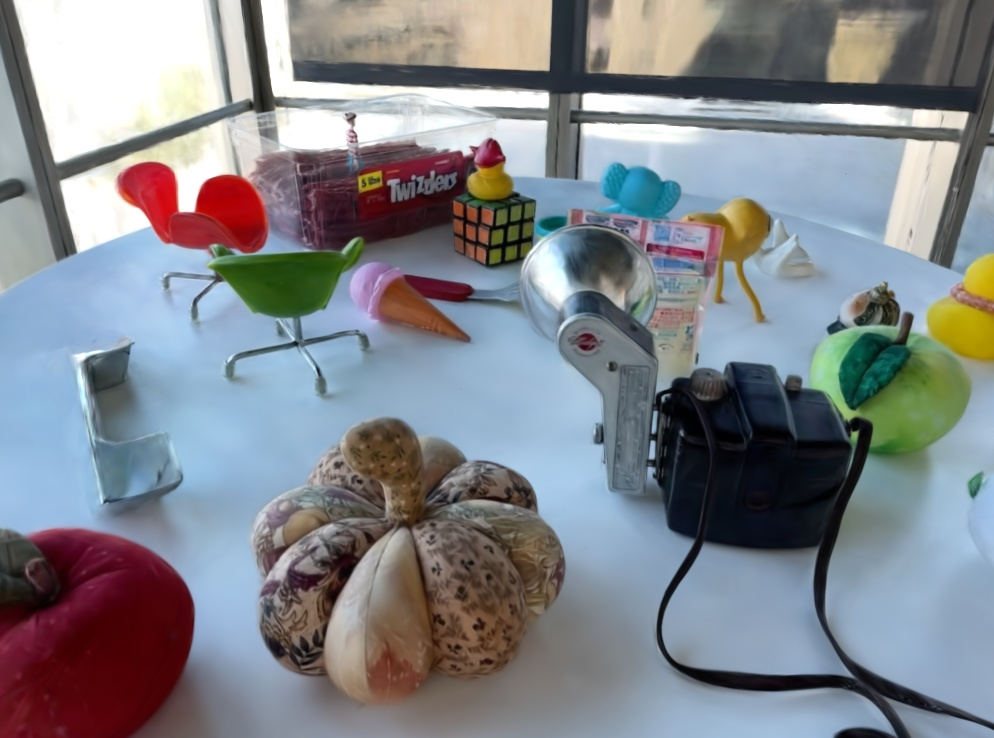
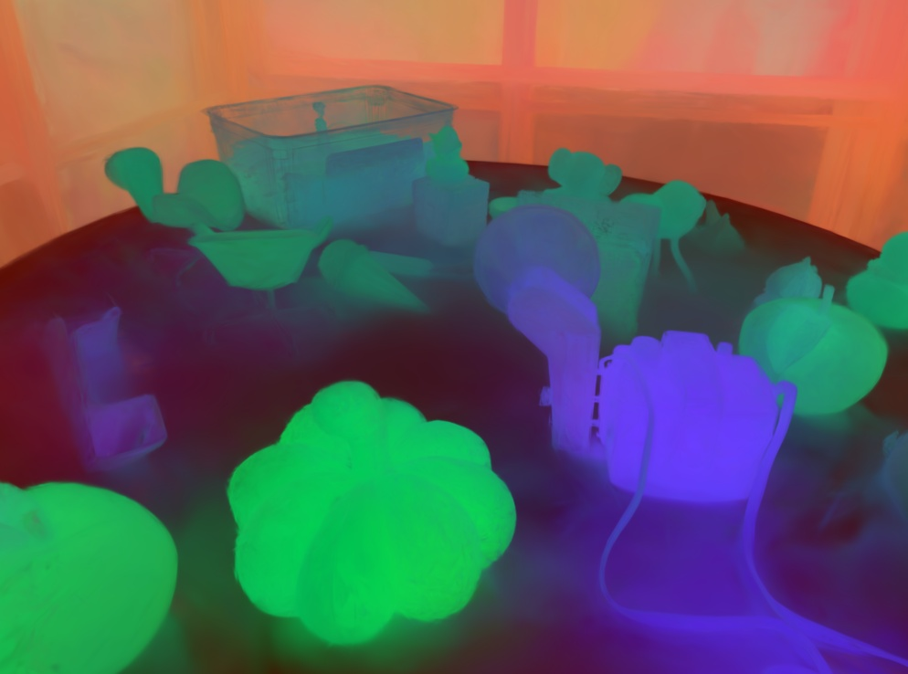

# Splat Distiller: One-pass distillation of 2D foundation models into 3D splats

## Quickstart

This project is built on top of the [gaussian-splatting](https://github.com/graphdeco-inria/gaussian-splatting), [gsplat](https://github.com/nerfstudio-project/gsplat), [beta-splatting](https://github.com/RongLiu-Leo/beta-splatting), and [Featup](https://github.com/mhamilton723/FeatUp) code bases. The authors are grateful to the original authors for their open-source codebase contributions.

### Installation Steps

1. **Clone the Repository:**
   ```sh
   git clone --single-branch --branch main https://github.com/saliteta/splat-distiller.git
   cd splat-distiller
   ```
1. **Set Up the Conda Environment:**
    ```sh
    conda create -y -n splat_distiller python=3.10
    conda activate splat_distiller
    ```
1. **Install [Pytorch](https://pytorch.org/get-started/locally/) (Based on Your CUDA Version)**
    ```sh
    pip3 install torch torchvision torchaudio --index-url https://download.pytorch.org/whl/cu118
    ```
1. **Install Dependencies and Submodules:**
    ```sh
    pip install submodules/bsplat
    pip install submodules/feature_lift
    pip install submodules/gsplat
    ```


### Processing your own Scenes

The project expect the following dataset structure in the source path location:

```
<location>
|---images
|   |---<image 0>
|   |---<image 1>
|   |---...
|---features
|   |---<feature 0>
|   |---<feature 1>
|   |---...
|---sparse
    |---0
        |---cameras.bin
        |---images.bin
        |---points3D.bin
```
To prepare the required dataset, please put the images you want to use in a directory ```<location>/input```.
```
<location>
|---input
    |---<image 0>
    |---<image 1>
    |---...
```
Then
#### 1. Calibrate images via COLMAP
```shell
python convert.py -s <location>
```

<details>
<summary><span style="font-weight: bold;">Command Line Arguments for convert.py</span></summary>

  #### --no_gpu
  Flag to avoid using GPU in COLMAP.
  #### --skip_matching
  Flag to indicate that COLMAP info is available for images.
  #### --source_path / -s
  Location of the inputs.
  #### --camera 
  Which camera model to use for the early matching steps, ```OPENCV``` by default.
  #### --resize
  Flag for creating resized versions of input images.
  #### --colmap_executable
  Path to the COLMAP executable (```.bat``` on Windows).
  #### --magick_executable
  Path to the ImageMagick executable.
</details>
<br>

#### 2. Extract features via FeatUp

```shell
python feature_extractor.py -s <location> --model <model>
```

<details>
<summary><span style="font-weight: bold;">Command Line Arguments for feature_extractor.py</span></summary>

  #### --source_path / -s
  Location of the inputs.
  #### --model 
  Select the 2D foundation model from the list: dino16, dinov2, clip, maskclip, vit, resnet50.
</details>
<br>

## TO DO

- Adding training guidance
- Loading and so on


## Distiller (already get a trained model)
After obtaining the trained model (assuming using the normalied coordinates)
we obtaining the 3D features assigned to Gaussian in the following way:
- In general
```
python gaussian_inverse_splating.py --data_location ${your colmap folder} --data_mode gsplat_colmap --pretrained_location ${your gaussian geomtry obtained using simple trainer, in .pt format} --feature_location ${2D features collected by utilizing feat up} --output_feature ${place you store the features}
```
- 2D GS
```
python gaussian_inverse_splating.py --data_location ${your colmap folder} --data_mode gsplat_colmap --pretrained_location ${your gaussian geomtry obtained using simple trainer 2d gs, in .pt format} --feature_location ${2D features collected by utilizing feat up} --output_feature ${place you store the features} --mode 2DGS
```


## Evaluation Example
For 2D Downstream task, we have to project feature to 2D, if one wants to see 3D segment result, please check the next section
- After finising above procedure, we will find the result in the designated eval path 
- We will have three folder for each scene, one for rendered rgb, one for 2D feature map, and one for feature_pca
- Notice that feature is high dimensional file, feature PCA is just for visualization

|  |  |
|-----------------|-----------------|
