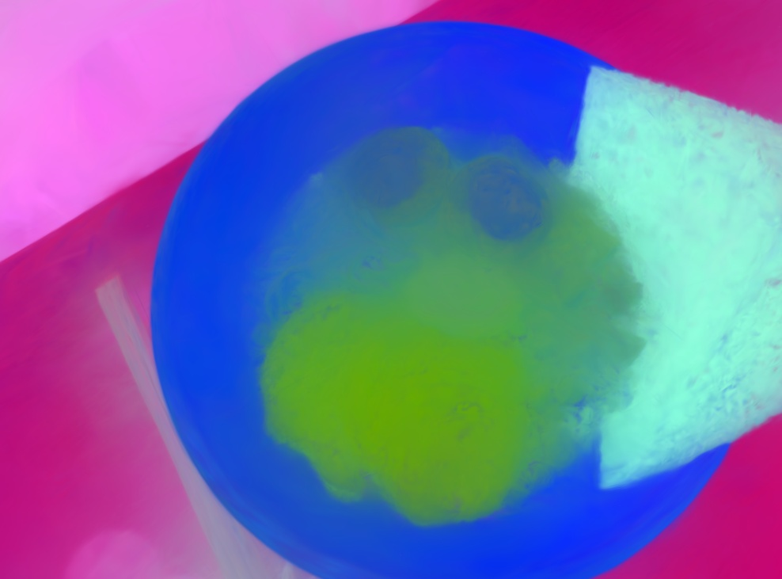

# Splat Distiller: One-pass distillation of 2D foundation models into 3D splats

## Quickstart

This project is built on top of the [gaussian-splatting](https://github.com/graphdeco-inria/gaussian-splatting), [gsplat](https://github.com/nerfstudio-project/gsplat), [beta-splatting](https://github.com/RongLiu-Leo/beta-splatting), [LAGA](https://github.com/SJTU-DeepVisionLab/LaGa)and [Featup](https://github.com/mhamilton723/FeatUp) code bases. The authors are grateful to the original authors for their open-source codebase contributions.

### Installation Steps


0. **Clone the Repository:**
   ```sh
   git clone --single-branch --branch main https://github.com/saliteta/splat-distiller.git
   cd splat-distiller
   ```

1. **Set Up the Conda Environment:**
  Notice that if you can do this, you usally on a linux machine, otherwise check 
    ```sh
    conda env create -f environment.yml
    conda activate splat-distiller
    pip install torch==2.7.0 torchvision==0.22.0 torchaudio==2.7.0  --index-url https://download.pytorch.org/whl/cu128
    conda install -c pytorch -c nvidia faiss-gpu -y
    pip install .
    ```


2. **Set Up the Compiler (GCC | MSVC)** (Optional, if no error in 1, skip this)
    ```sh
    # on linux make sure install compiler on the conda env, you can install compilers manually through conda-forge
    # on windows it seems like the nvcc is based on micorsoft visual compiler, you need to set it to msvc 2022 or the one fit nvcc
    # You might manually set the path like the following
    set PATH=C:\Program Files (x86)\Microsoft Visual Studio\2022\BuildTools\VC\Tools\MSVC\${The version u use}\bin\Hostx64\x64\;%PATH%
    ```

3. **Set Up SAM** (Optional, if you want to use SAM OpenCLIP model)
    ```sh
      wget https://dl.fbaipublicfiles.com/segment_anything/sam_vit_h_4b8939.pth
    ```


### Processing your own Scenes 
- If just want to reproduce the result in paper, skip this part
The project expect the following dataset structure in the source path location:

```
<location>
|---images
|   |---<image 0>
|   |---<image 1>
|   |---...
|---features
|   |---<feature 0>
|   |---<feature 1>
|   |---...
|---sparse
    |---0
        |---cameras.bin
        |---images.bin
        |---points3D.bin
```
To prepare the required dataset, please put the images you want to use in a directory ```<location>/input```.
```
<location>
|---input
    |---<image 0>
    |---<image 1>
    |---...
```
Then
#### 1. Calibrate images via COLMAP
```shell
python convert.py -s <location>
```

<details>
<summary><span style="font-weight: bold;">Command Line Arguments for convert.py</span></summary>

  #### --no_gpu
  Flag to avoid using GPU in COLMAP.
  #### --skip_matching
  Flag to indicate that COLMAP info is available for images.
  #### --source_path / -s
  Location of the inputs.
  #### --camera 
  Which camera model to use for the early matching steps, ```OPENCV``` by default.
  #### --resize
  Flag for creating resized versions of input images.
  #### --colmap_executable
  Path to the COLMAP executable (```.bat``` on Windows).
  #### --magick_executable
  Path to the ImageMagick executable.
</details>
<br>


#### 2. Extract features via FeatUp
```shell
python feature_extractor.py -s <location> --model <model> --sam_ckpt_path <if use SAMOpenCLIP>
```

<details>
<summary><span style="font-weight: bold;">Command Line Arguments for feature_extractor.py</span></summary>

  #### --source_path / -s
  Location of the inputs.
  #### --model 
  Select the 2D foundation model from the list: dino16, dinov2, clip, maskclip, vit, resnet50, SAMOpenCLIP(paper metrics).

  #### --sam_ckpt_path (optional, if you use sam open clip)
</details>
<br>


### Evaluation Scripts
```
python eval.py --data-dir ${The colmap path} --ckpt ${Place you store the trained model} --label-dir ${stored json file}
```

### All in One Scripts
To run feature extraction, model training, feature lifting, rendering, and evaluation metrics in one scripts for lerf_ovs, we prepare the following scripts:
- Download Dataset
```
gdown 1QF1Po5p5DwTjFHu6tnTeYs_G0egMVmHt
unzip lerf_ovs
rm lerf_ovs.zip
##### Here You Need to modify the config.py file accordingly
python benchmark.py --config ${Your config .yaml} # default is for_metrics.yaml in congif/
```
The all the results should be in "results" folder
The results seperated by the scene name, and it has:
1. ckpts: The trained geometry, and lifted features
2. Features: Rendered Features from evaluation camera pose
3. Feature_PCA: Rendered Features after PCA for visualization from evaluation camera pose
4. metrics_images: Segmented results compare to ground truth
5. renderes: More rendered RGB images from different angles, at different training iteration
6. RGB: final rendered RGB at evaluation camera pose
7. frame_metrics.csv: per_frame calcualted results and whole scene average
8. others for training logs


There are some examples: 
<table>
  <tr>
    <td></td>
    <td></td>
  </tr>
</table>
left one are the feature PCA, and the right one is the metrics image


### Visualization and Query in 3D
To visualize and query in 3D, one can do the following. If one is using 3DGS 
cd gaussian_spaltting
python simple_viewer.py --ckpt {in the ckpt folder, there is a ckpt_29999} --feature_ckpt {optional, default is ckpt_29999_feature at the same folder}
examples: left one is when one visualize in relevance mode, input eggs, and the right one is the rendered rgb
<table>
  <tr>
    <td></td>
    <td></td>
  </tr>
</table>


### Adapting LAGA format Feature Extraction
LAGA and OpenGaussian and LangSplat all use about the same way of feature extraction, however, it usually takes around 
2 hours to process one scene. By utilizing their preprocessed feature, we can further boost our mIoU at the cost of time.
to use, simply do the following
```
pip install git+https://github.com/facebookresearch/segment-anything.git
```

Then we can run:
```
cd laga
pre_processing.py --help
feature_converter.py --help 
```
One script to generate langsplat original data
One script to convert feature to our format


### LangSplat Feature and Positional Embeddings
Currently, we add all those information into the metrics.py
One need to explicityly name the --text-encoder to SAMOpenCLIP to make it work
```
python eval.py --text-encoder {sam_clip} ...
```


### We re-write the CLIP+SAM feature + Cluster for segmentation
- It is still lifting, actually really fast
- We adding the quick cluster, a little hard to install on 4090, changed to rapidsai 25.06
- CUDA toolkit 12.6, pytorch 2.7.1 
- Should additionally install omega-conf and hydra

to run modify the config/for_metrics.yaml part and run:
```
python benchmark.py
```


### Some examples
<table>
  <tr>
    <td></td>
    <td></td>
  </tr>
</table>


<table>
  <tr>
    <td></td>
    <td></td>
  </tr>
</table>