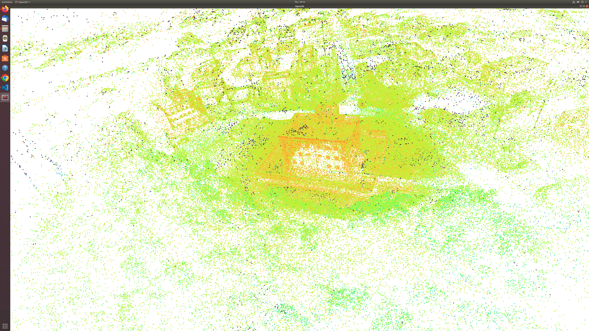
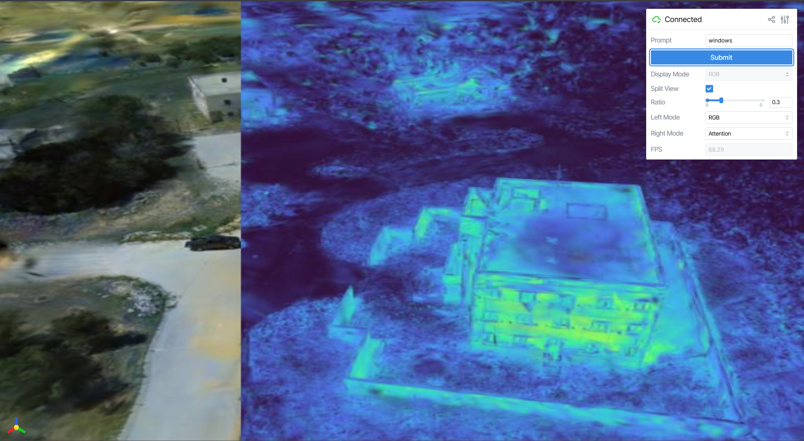
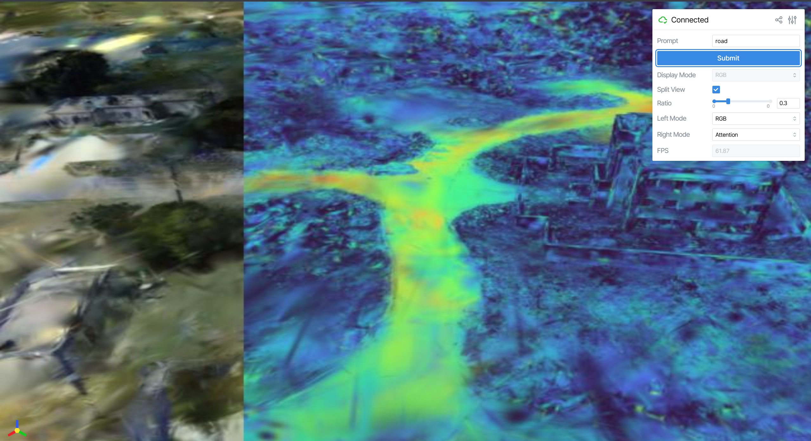

# Motivation
Is there an analytical solution that can make Gaussian Represenation be optimal given difference view's color? 
Answer will be yes. Detailed proof will be introduced in a notion
In this way, we decrease the calculation time and memory consumption. 
In RTX 3090, we have 200 views, and our prohjection time takes 6 mins, memory consumption is around 4 GB

# Installation
1. First follow nerfstudio guidance, install nerfstudio
2. clone this repository, nerfstudio environment run:
```
    pip install .
```
3. After doing this, you might exam by import gsplat_ext

# Data Preparation
```
ns-train splatfacto --data {some colmap dataset dataset} --output_dir {some place u store the model} colmap # we only support colmap structure for now
```
```
# One need to prepare their own feature map in 2D them self, we use featup mask-clip, and save the feature for each image the same name as image
# But they are at /feat folder, with .pt as post-fix
├── camera_paths
├── colmap # ther sparse folder there
├── distorted
├── feat # The place you hold your feature_....pt files 
├── images
├── images_2
├── input
├── run-colmap-geometric.sh
├── run-colmap-photometric.sh
└── stereo
```

```
python gaussian_inverse_splating.py --colmap_location {data you passed in the last line} --ckpt {pt ckpt you pretrained in last line} --output_feature {place u want to store the feature}
```


# Visualization Result: 
## Point Cloud Visualization

Use the center points of Gaussian to represent a point to do point cloud visualization. The reconstructions is municipal, the input text is windows
It takes about 6mins to finish Gaussian feature lifting. I implemented it in CUDA, after profiling, the time cost mainly come from random Gaussian index query
One can find that there it works, but not good

## Gaussian Splatting Visualization
We implement a feature embedding visualization module using FeatUP, detail in /view_embedding

This is the result using windows as input query text

This is the result using road as input query text


## Down Stream Task: Open Vacabulary Segmentation
- Our method is threshold free
- Our method uses the idea of contrastive learning, by select negative/background word, we can successfully and accuratly segment out user input object: 


## New Standard
- We add the Gaussian Downsample Scripts, for large scale scene, we will only use 1 M Gaussian for simplicity, to use more, please see the gaussian_inverse_splatting.py code
- We add support to original PLY IO, and we assume COLMAP input format, and no additional change of camera coordinates
- We assume we have the dataset in the form of LeRF dataset. Very small dataset, and we run multiple experiment easily
- We implement visualization scripts, and training scripts


## 2D GS Lifting Backbone
- Using feature viewer, we can find the small different, 2DGS has more 
- We also added the 2D GS Lifting Backbone, and it shows the following
- In the feature viewer, we add the 2DGS feature viewer


Query result of "chopsticks", scale is of 2D AND 3D are all set to 0.5, it shows that 2D-GS indeed have higher attention concentration.